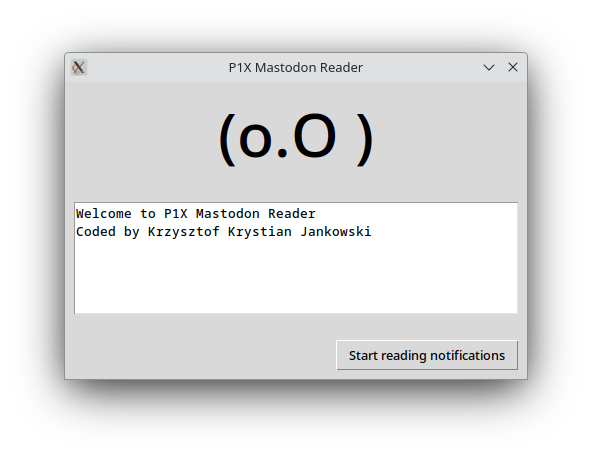

## P1X Mastodon Reader
Reads (audio) notifications from Mastodon instance.



## Setup
Here are all the Python libraries that are needed to be installed using pip for the script:

* Mastodon.py: A Python wrapper for the Mastodon (a federated social network) API.
* gTTS (Google Text-to-Speech): A Python library interface to Google's Text to Speech API.
* beautifulsoup4: A Python library for pulling data out of HTML and XML files.

You can install these dependencies using the following pip commands:

```pip install Mastodon.py gTTS beautifulsoup4 pillow```

Please ensure that your Python environment is set up and activated before running these commands. If you're using Python 3, you might need to use pip3 instead of pip.

You'll also need to have mpg123 installed in your Linux system for playing the mp3 files generated by GTTS. If not installed, you can install it using the command:

```sudo apt-get install mpg123```

This should install all necessary dependencies for the script to work properly.

Copy the credentials file and update its content.

```cp credentials.dist.json credentials.json```
